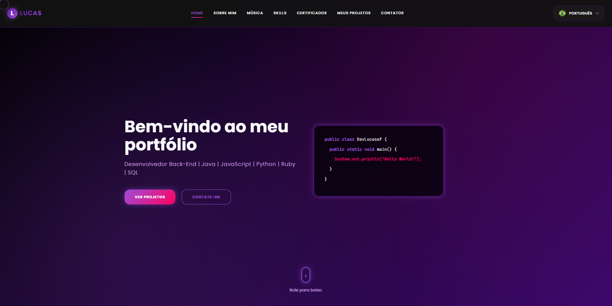

# Portfólio



# 💻 Sobre

Projeto feito no intuito de me apresentar, como desenvolvedor back-end.

# 🗃️ Estrutura

```
/Portifolio
 ├── index.html
 ├── css/
 │   └── style.css
 ├── js/
 │   ├── translation
 │   │   ├── portuguese.js
 │   │   └── english.js
 │   ├── translations.js
 │   ├── spotify-loader.js
 │   └── script.js
 ├── assets/
 │   ├── flags/
 │   └── imgs/
 └── README.md
```

# 🤯 Composição do site

- **Home:** Minha apresentação.
- **Sobre mim:** abordo uma pequena apresentação sobre mim e a minha trajetória.
- **Música:** minhas principais playlist e o que escuto agora.
- **Skills:** liguagens e ferramentas que eu utilizo.
- **Certificados:** certificados dos cursos que concluí.
- **Meus Projetos:** alguns projetos desenvolvidos recentemente por mim.
- **Contatos:** minhas redes sociais e formas de entrar em contato comigo.

# 🛠️ Tecnologias utilizadas

<div align="left">
    
    
    
    
    
    
    
</div>

## 🏆 Licença

The [MIT License](./LICENSE).


